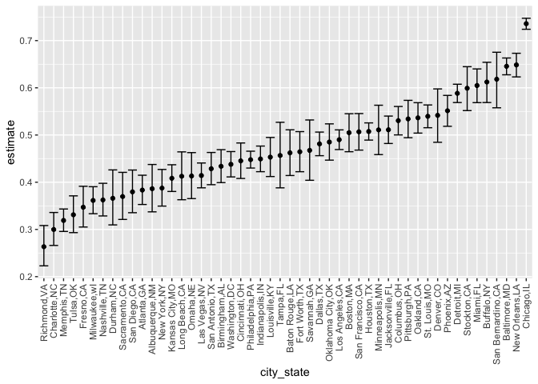
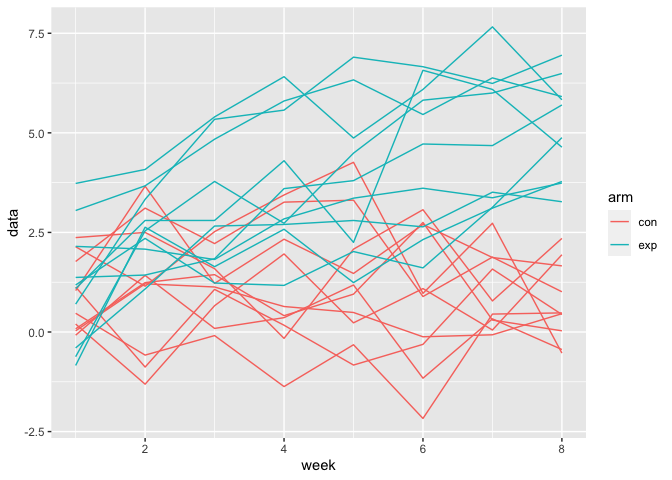

DataScience\_hm5
================
KaiYu He(kh3074)
11/16/2021

``` r
library(tidyverse)
```

    ## ── Attaching packages ─────────────────────────────────────── tidyverse 1.3.1 ──

    ## ✓ ggplot2 3.3.5     ✓ purrr   0.3.4
    ## ✓ tibble  3.1.2     ✓ dplyr   1.0.7
    ## ✓ tidyr   1.1.3     ✓ stringr 1.4.0
    ## ✓ readr   2.0.1     ✓ forcats 0.5.1

    ## ── Conflicts ────────────────────────────────────────── tidyverse_conflicts() ──
    ## x dplyr::filter() masks stats::filter()
    ## x dplyr::lag()    masks stats::lag()

# Problem 1

``` r
homicide_df = 
  read_csv("data/homicide-data.csv",na = c("","Unkonw")) %>%
  mutate(
    city_state = str_c(city,",",state),
    resolution = case_when(
      disposition == "Closed without arrest" ~ "unsolved",
      disposition == "Open/No arrest" ~ "unsolved",
      disposition == "Closed by arrest" ~ "solved"
    )) %>%
  relocate(city_state)%>%
  filter(city_state != "Tusla,AL")
```

    ## Rows: 52179 Columns: 12

    ## ── Column specification ────────────────────────────────────────────────────────
    ## Delimiter: ","
    ## chr (9): uid, victim_last, victim_first, victim_race, victim_age, victim_sex...
    ## dbl (3): reported_date, lat, lon

    ## 
    ## ℹ Use `spec()` to retrieve the full column specification for this data.
    ## ℹ Specify the column types or set `show_col_types = FALSE` to quiet this message.

``` r
homicide_df%>%count(city_state)
```

    ## # A tibble: 51 x 2
    ##    city_state         n
    ##    <chr>          <int>
    ##  1 Albuquerque,NM   378
    ##  2 Atlanta,GA       973
    ##  3 Baltimore,MD    2827
    ##  4 Baton Rouge,LA   424
    ##  5 Birmingham,AL    800
    ##  6 Boston,MA        614
    ##  7 Buffalo,NY       521
    ##  8 Charlotte,NC     687
    ##  9 Chicago,IL      5535
    ## 10 Cincinnati,OH    694
    ## # … with 41 more rows

Let’s focus on Baltimore,MD.

``` r
baltimore_df = 
  homicide_df%>%
  filter(city_state == "Baltimore,MD")

baltimore_summary = 
  baltimore_df%>%
  summarize(
    unsolved = sum(resolution == "unsolved"),
    n = n()
  )

baltimore_test = 
  prop.test(
  x = baltimore_summary%>%pull(unsolved),
  n = baltimore_summary%>%pull(n)
  )

baltimore_test %>%
  broom::tidy()
```

    ## # A tibble: 1 x 8
    ##   estimate statistic  p.value parameter conf.low conf.high method    alternative
    ##      <dbl>     <dbl>    <dbl>     <int>    <dbl>     <dbl> <chr>     <chr>      
    ## 1    0.646      239. 6.46e-54         1    0.628     0.663 1-sample… two.sided

let’s try to iterate across cities! First off, write a function.

``` r
prop_test_function = function(city_df)
  {
  city_summary = 
  city_df%>%
  summarize(
    unsolved = sum(resolution == "unsolved"),
    n = n()
  )

city_test = 
  prop.test(
  x = city_summary%>%pull(unsolved),
  n = city_summary%>%pull(n)
  )
  }
```

Now, let’s iterate across all cities.

``` r
results_df =
  homicide_df%>%
  nest(data = uid:resolution)%>%
  mutate(
    test_result = map(data,prop_test_function),
    tidy_result = map(test_result,broom::tidy)
  )%>%
  select(city_state,tidy_result)%>%
  unnest(tidy_result)%>%
  select(city_state,estimate,starts_with("conf"))
```

    ## Warning in prop.test(x = city_summary %>% pull(unsolved), n = city_summary %>% :
    ## Chi-squared approximation may be incorrect

``` r
results_df
```

    ## # A tibble: 51 x 4
    ##    city_state     estimate conf.low conf.high
    ##    <chr>             <dbl>    <dbl>     <dbl>
    ##  1 Albuquerque,NM    0.386    0.337     0.438
    ##  2 Atlanta,GA        0.383    0.353     0.415
    ##  3 Baltimore,MD      0.646    0.628     0.663
    ##  4 Baton Rouge,LA    0.462    0.414     0.511
    ##  5 Birmingham,AL     0.434    0.399     0.469
    ##  6 Boston,MA         0.505    0.465     0.545
    ##  7 Buffalo,NY        0.612    0.569     0.654
    ##  8 Charlotte,NC      0.300    0.266     0.336
    ##  9 Chicago,IL        0.736    0.724     0.747
    ## 10 Cincinnati,OH     0.445    0.408     0.483
    ## # … with 41 more rows

Try to make a plot showing estimates and confidence intervals.

``` r
results_df%>%
  filter(city_state!="Tulsa,AL")%>%
  mutate(city_state = fct_reorder(city_state,estimate))%>%
  ggplot(aes(x = city_state,y = estimate))+
  geom_point()+
  geom_errorbar(aes(ymin = conf.low,ymax = conf.high))+
  theme(axis.text.x = element_text(angle = 90,vjust = 0.5,hjust = 1))
```

<!-- -->

# Problem 2

### Create a tidy dataframe

Method\_1 using a for loop.

``` r
data_raw = tibble() # Create an empty data frame
Arm = c("exp","con")
Id = str_pad(string = 1:10,width = 2,side = 'left',pad = '0')
for (id in Id){
  for (arm in Arm){
    arm_id = 
      read_csv(str_c("data/Problem_2_data/",arm,"_",id,".csv")) %>%
      mutate(id = id,arm = arm)%>%
      relocate(arm,id)
    data_raw = bind_rows(data_raw,arm_id)
  }
}
```

``` r
data_tidy = 
  data_raw%>%
  janitor::clean_names()%>%
  pivot_longer(week_1:week_8,
              names_to = 'week',
              values_to = 'data')%>%
  mutate(subject = str_c(arm,id))%>%
  select(subject,week,data)%>%
  pivot_wider(names_from = subject,values_from = data)%>%
  mutate(week = as.numeric(str_remove(week,"week_")))
data_tidy%>%
  knitr::kable()
```

| week | exp01 | con01 | exp02 | con02 | exp03 | con03 | exp04 | con04 | exp05 | con05 | exp06 | con06 | exp07 | con07 | exp08 | con08 | exp09 | con09 | exp10 | con10 |
|-----:|------:|------:|------:|------:|------:|------:|------:|------:|------:|------:|------:|------:|------:|------:|------:|------:|------:|------:|------:|------:|
|    1 |  3.05 |  0.20 | -0.84 |  1.13 |  2.15 |  1.77 | -0.62 |  1.04 |  0.70 |  0.47 |  3.73 |  2.37 |  1.18 |  0.03 |  1.37 | -0.08 | -0.40 |  0.08 |  1.09 |  2.14 |
|    2 |  3.67 | -1.31 |  2.63 | -0.88 |  2.08 |  3.11 |  2.54 |  3.66 |  3.33 | -0.58 |  4.08 |  2.50 |  2.35 |  1.21 |  1.43 |  1.42 |  1.08 |  1.24 |  2.80 |  1.15 |
|    3 |  4.84 |  0.66 |  1.64 |  1.07 |  1.82 |  2.22 |  3.78 |  1.22 |  5.34 | -0.09 |  5.40 |  1.59 |  1.23 |  1.13 |  1.84 |  0.09 |  2.66 |  1.44 |  2.80 |  2.52 |
|    4 |  5.80 |  1.96 |  2.58 |  0.17 |  2.84 |  3.26 |  2.73 |  2.33 |  5.57 | -1.37 |  6.41 | -0.16 |  1.17 |  0.64 |  3.60 |  0.36 |  2.70 |  0.41 |  4.30 |  3.44 |
|    5 |  6.33 |  0.23 |  1.24 | -0.83 |  3.36 |  3.31 |  4.49 |  1.47 |  6.90 | -0.32 |  4.87 |  2.08 |  2.02 |  0.49 |  3.80 |  1.18 |  2.80 |  0.95 |  2.25 |  4.26 |
|    6 |  5.46 |  1.09 |  2.32 | -0.31 |  3.61 |  0.89 |  5.82 |  2.70 |  6.66 | -2.17 |  6.09 |  3.07 |  1.61 | -0.12 |  4.72 | -1.16 |  2.64 |  2.75 |  6.57 |  0.97 |
|    7 |  6.38 |  0.05 |  3.11 |  1.58 |  3.37 |  1.88 |  6.00 |  1.87 |  6.24 |  0.45 |  7.66 |  0.78 |  3.13 | -0.07 |  4.68 |  0.33 |  3.51 |  0.30 |  6.09 |  2.73 |
|    8 |  5.91 |  1.94 |  3.78 |  0.44 |  3.74 |  1.01 |  6.49 |  1.66 |  6.95 |  0.48 |  5.83 |  2.35 |  4.88 |  0.46 |  5.70 | -0.44 |  3.27 |  0.03 |  4.64 | -0.53 |

Method\_2 using purrr package

``` r
data_raw = 
  tibble(
  file_names = list.files(path = "data/Problem_2_data/")
)%>%
  mutate(file_names = str_c("data/Problem_2_data/",file_names))%>%
  mutate(data = map(file_names,read_csv))%>%
  unnest(data)%>%
  mutate(
    file_names = str_remove(file_names,"data/Problem_2_data/"),
    file_names = str_remove(file_names,".csv")
    )%>%
  separate(file_names,into = c("arm","id"),sep = '_')
```

``` r
data_tidy = 
  data_raw%>%
  janitor::clean_names()%>%
  pivot_longer(week_1:week_8,
              names_to = 'week',
              values_to = 'data')%>%
  mutate(subject = str_c(arm,id))%>%
  select(subject,week,data)%>%
  pivot_wider(names_from = subject,values_from = data)%>%
  mutate(week = as.numeric(str_remove(week,"week_")))
data_tidy%>%
  knitr::kable()
```

| week | con01 | con02 | con03 | con04 | con05 | con06 | con07 | con08 | con09 | con10 | exp01 | exp02 | exp03 | exp04 | exp05 | exp06 | exp07 | exp08 | exp09 | exp10 |
|-----:|------:|------:|------:|------:|------:|------:|------:|------:|------:|------:|------:|------:|------:|------:|------:|------:|------:|------:|------:|------:|
|    1 |  0.20 |  1.13 |  1.77 |  1.04 |  0.47 |  2.37 |  0.03 | -0.08 |  0.08 |  2.14 |  3.05 | -0.84 |  2.15 | -0.62 |  0.70 |  3.73 |  1.18 |  1.37 | -0.40 |  1.09 |
|    2 | -1.31 | -0.88 |  3.11 |  3.66 | -0.58 |  2.50 |  1.21 |  1.42 |  1.24 |  1.15 |  3.67 |  2.63 |  2.08 |  2.54 |  3.33 |  4.08 |  2.35 |  1.43 |  1.08 |  2.80 |
|    3 |  0.66 |  1.07 |  2.22 |  1.22 | -0.09 |  1.59 |  1.13 |  0.09 |  1.44 |  2.52 |  4.84 |  1.64 |  1.82 |  3.78 |  5.34 |  5.40 |  1.23 |  1.84 |  2.66 |  2.80 |
|    4 |  1.96 |  0.17 |  3.26 |  2.33 | -1.37 | -0.16 |  0.64 |  0.36 |  0.41 |  3.44 |  5.80 |  2.58 |  2.84 |  2.73 |  5.57 |  6.41 |  1.17 |  3.60 |  2.70 |  4.30 |
|    5 |  0.23 | -0.83 |  3.31 |  1.47 | -0.32 |  2.08 |  0.49 |  1.18 |  0.95 |  4.26 |  6.33 |  1.24 |  3.36 |  4.49 |  6.90 |  4.87 |  2.02 |  3.80 |  2.80 |  2.25 |
|    6 |  1.09 | -0.31 |  0.89 |  2.70 | -2.17 |  3.07 | -0.12 | -1.16 |  2.75 |  0.97 |  5.46 |  2.32 |  3.61 |  5.82 |  6.66 |  6.09 |  1.61 |  4.72 |  2.64 |  6.57 |
|    7 |  0.05 |  1.58 |  1.88 |  1.87 |  0.45 |  0.78 | -0.07 |  0.33 |  0.30 |  2.73 |  6.38 |  3.11 |  3.37 |  6.00 |  6.24 |  7.66 |  3.13 |  4.68 |  3.51 |  6.09 |
|    8 |  1.94 |  0.44 |  1.01 |  1.66 |  0.48 |  2.35 |  0.46 | -0.44 |  0.03 | -0.53 |  5.91 |  3.78 |  3.74 |  6.49 |  6.95 |  5.83 |  4.88 |  5.70 |  3.27 |  4.64 |

### Spaghetti plot

``` r
data_tidy%>%
  pivot_longer(con01:exp10,
               names_to = 'subject',
               values_to = 'data')%>%
  mutate(arm = substr(subject,1,3))%>%
  ggplot(aes(x = week,y = data,group = subject))+
  geom_line(aes(color = arm))
```

<!-- -->

-   From the grouped line plot we can conclude that the value of
    experiment group is greater than control group.

# Problem 3

### Introduce data

``` r
set.seed(10)
iris_with_missing = iris %>% 
  map_df(~replace(.x, sample(1:150, 20), NA)) %>%
  mutate(Species = as.character(Species))

iris_with_missing = 
  iris_with_missing%>%
  janitor::clean_names()
iris_with_missing
```

    ## # A tibble: 150 x 5
    ##    sepal_length sepal_width petal_length petal_width species
    ##           <dbl>       <dbl>        <dbl>       <dbl> <chr>  
    ##  1          5.1         3.5          1.4         0.2 setosa 
    ##  2          4.9         3            1.4         0.2 setosa 
    ##  3          4.7         3.2          1.3         0.2 setosa 
    ##  4          4.6         3.1          1.5        NA   setosa 
    ##  5          5           3.6          1.4         0.2 setosa 
    ##  6          5.4         3.9          1.7         0.4 setosa 
    ##  7         NA           3.4          1.4         0.3 setosa 
    ##  8          5           3.4          1.5         0.2 setosa 
    ##  9          4.4         2.9          1.4         0.2 setosa 
    ## 10          4.9         3.1         NA           0.1 setosa 
    ## # … with 140 more rows

``` r
fill_missing = function(vector){
  if(typeof(vector[1])=="double"){
  mean = mean(vector,na.rm = TRUE)
  vector[is.na(vector)] = mean
  round(vector,2)
  vector
  }
  else {
    vector[is.na(vector)] = "virginica"
    vector
  }
}

#return the df of filled data
iris_with_missing %>%
  map_df(fill_missing)%>%
  head(10)%>%
  knitr::kable()
```

| sepal\_length | sepal\_width | petal\_length | petal\_width | species |
|--------------:|-------------:|--------------:|-------------:|:--------|
|      5.100000 |          3.5 |      1.400000 |     0.200000 | setosa  |
|      4.900000 |          3.0 |      1.400000 |     0.200000 | setosa  |
|      4.700000 |          3.2 |      1.300000 |     0.200000 | setosa  |
|      4.600000 |          3.1 |      1.500000 |     1.192308 | setosa  |
|      5.000000 |          3.6 |      1.400000 |     0.200000 | setosa  |
|      5.400000 |          3.9 |      1.700000 |     0.400000 | setosa  |
|      5.819231 |          3.4 |      1.400000 |     0.300000 | setosa  |
|      5.000000 |          3.4 |      1.500000 |     0.200000 | setosa  |
|      4.400000 |          2.9 |      1.400000 |     0.200000 | setosa  |
|      4.900000 |          3.1 |      3.765385 |     0.100000 | setosa  |

``` r
# return the vector 
iris_with_missing %>%
  map(fill_missing)
```

    ## $sepal_length
    ##   [1] 5.100000 4.900000 4.700000 4.600000 5.000000 5.400000 5.819231 5.000000
    ##   [9] 4.400000 4.900000 5.400000 4.800000 5.819231 4.300000 5.819231 5.700000
    ##  [17] 5.400000 5.100000 5.700000 5.100000 5.400000 5.100000 4.600000 5.819231
    ##  [25] 4.800000 5.000000 5.000000 5.200000 5.819231 4.700000 4.800000 5.400000
    ##  [33] 5.200000 5.500000 4.900000 5.000000 5.500000 4.900000 4.400000 5.100000
    ##  [41] 5.000000 4.500000 4.400000 5.000000 5.100000 4.800000 5.100000 4.600000
    ##  [49] 5.300000 5.000000 7.000000 6.400000 6.900000 5.500000 6.500000 5.700000
    ##  [57] 6.300000 4.900000 6.600000 5.200000 5.000000 5.900000 6.000000 6.100000
    ##  [65] 5.600000 6.700000 5.600000 5.800000 6.200000 5.600000 5.900000 5.819231
    ##  [73] 6.300000 5.819231 6.400000 6.600000 6.800000 6.700000 6.000000 5.700000
    ##  [81] 5.500000 5.819231 5.800000 6.000000 5.400000 5.819231 6.700000 5.819231
    ##  [89] 5.600000 5.500000 5.500000 5.819231 5.800000 5.000000 5.819231 5.700000
    ##  [97] 5.700000 6.200000 5.100000 5.700000 6.300000 5.800000 7.100000 6.300000
    ## [105] 6.500000 7.600000 4.900000 7.300000 6.700000 5.819231 6.500000 5.819231
    ## [113] 6.800000 5.700000 5.800000 6.400000 6.500000 7.700000 7.700000 6.000000
    ## [121] 5.819231 5.600000 7.700000 6.300000 6.700000 7.200000 6.200000 6.100000
    ## [129] 6.400000 7.200000 7.400000 7.900000 6.400000 5.819231 6.100000 5.819231
    ## [137] 5.819231 6.400000 6.000000 6.900000 6.700000 6.900000 5.819231 6.800000
    ## [145] 6.700000 6.700000 6.300000 6.500000 5.819231 5.900000
    ## 
    ## $sepal_width
    ##   [1] 3.500000 3.000000 3.200000 3.100000 3.600000 3.900000 3.400000 3.400000
    ##   [9] 2.900000 3.100000 3.075385 3.400000 3.075385 3.000000 4.000000 4.400000
    ##  [17] 3.900000 3.500000 3.800000 3.800000 3.400000 3.700000 3.600000 3.300000
    ##  [25] 3.400000 3.000000 3.400000 3.500000 3.400000 3.200000 3.100000 3.075385
    ##  [33] 3.075385 4.200000 3.100000 3.200000 3.500000 3.600000 3.000000 3.400000
    ##  [41] 3.500000 3.075385 3.200000 3.500000 3.800000 3.000000 3.800000 3.200000
    ##  [49] 3.700000 3.075385 3.075385 3.200000 3.100000 2.300000 2.800000 2.800000
    ##  [57] 3.300000 2.400000 2.900000 2.700000 2.000000 3.000000 2.200000 2.900000
    ##  [65] 2.900000 3.100000 3.000000 3.075385 2.200000 2.500000 3.200000 2.800000
    ##  [73] 2.500000 2.800000 2.900000 3.000000 2.800000 3.075385 3.075385 2.600000
    ##  [81] 2.400000 2.400000 2.700000 2.700000 3.000000 3.400000 3.100000 3.075385
    ##  [89] 3.000000 2.500000 3.075385 3.075385 3.075385 2.300000 2.700000 3.000000
    ##  [97] 2.900000 2.900000 2.500000 2.800000 3.075385 2.700000 3.000000 2.900000
    ## [105] 3.075385 3.000000 2.500000 2.900000 3.075385 3.600000 3.200000 2.700000
    ## [113] 3.000000 3.075385 2.800000 3.200000 3.000000 3.800000 2.600000 2.200000
    ## [121] 3.200000 3.075385 2.800000 2.700000 3.300000 3.200000 2.800000 3.000000
    ## [129] 2.800000 3.000000 2.800000 3.800000 2.800000 2.800000 3.075385 3.000000
    ## [137] 3.400000 3.100000 3.000000 3.100000 3.100000 3.100000 2.700000 3.200000
    ## [145] 3.300000 3.000000 2.500000 3.000000 3.400000 3.000000
    ## 
    ## $petal_length
    ##   [1] 1.400000 1.400000 1.300000 1.500000 1.400000 1.700000 1.400000 1.500000
    ##   [9] 1.400000 3.765385 1.500000 1.600000 1.400000 3.765385 3.765385 1.500000
    ##  [17] 1.300000 1.400000 1.700000 1.500000 1.700000 1.500000 1.000000 3.765385
    ##  [25] 1.900000 3.765385 1.600000 1.500000 1.400000 1.600000 3.765385 1.500000
    ##  [33] 1.500000 1.400000 3.765385 1.200000 1.300000 1.400000 1.300000 1.500000
    ##  [41] 1.300000 1.300000 1.300000 1.600000 1.900000 1.400000 1.600000 3.765385
    ##  [49] 1.500000 1.400000 4.700000 4.500000 4.900000 4.000000 4.600000 4.500000
    ##  [57] 4.700000 3.765385 4.600000 3.900000 3.765385 4.200000 4.000000 4.700000
    ##  [65] 3.600000 4.400000 4.500000 4.100000 4.500000 3.900000 4.800000 4.000000
    ##  [73] 4.900000 3.765385 4.300000 4.400000 4.800000 5.000000 4.500000 3.500000
    ##  [81] 3.800000 3.700000 3.900000 5.100000 4.500000 4.500000 4.700000 4.400000
    ##  [89] 3.765385 4.000000 4.400000 4.600000 4.000000 3.300000 4.200000 4.200000
    ##  [97] 4.200000 4.300000 3.000000 4.100000 3.765385 5.100000 5.900000 5.600000
    ## [105] 5.800000 6.600000 4.500000 6.300000 3.765385 3.765385 5.100000 5.300000
    ## [113] 5.500000 5.000000 5.100000 5.300000 3.765385 6.700000 6.900000 5.000000
    ## [121] 5.700000 4.900000 6.700000 4.900000 5.700000 6.000000 4.800000 4.900000
    ## [129] 5.600000 5.800000 6.100000 3.765385 3.765385 5.100000 5.600000 6.100000
    ## [137] 5.600000 5.500000 4.800000 5.400000 5.600000 5.100000 5.100000 3.765385
    ## [145] 3.765385 5.200000 5.000000 5.200000 5.400000 5.100000
    ## 
    ## $petal_width
    ##   [1] 0.200000 0.200000 0.200000 1.192308 0.200000 0.400000 0.300000 0.200000
    ##   [9] 0.200000 0.100000 0.200000 0.200000 0.100000 0.100000 0.200000 0.400000
    ##  [17] 0.400000 1.192308 0.300000 1.192308 0.200000 0.400000 0.200000 0.500000
    ##  [25] 0.200000 0.200000 0.400000 0.200000 0.200000 0.200000 0.200000 0.400000
    ##  [33] 0.100000 0.200000 0.200000 0.200000 0.200000 0.100000 1.192308 0.200000
    ##  [41] 0.300000 1.192308 0.200000 0.600000 0.400000 0.300000 0.200000 0.200000
    ##  [49] 0.200000 0.200000 1.400000 1.500000 1.500000 1.300000 1.500000 1.300000
    ##  [57] 1.600000 1.000000 1.300000 1.400000 1.000000 1.500000 1.192308 1.400000
    ##  [65] 1.300000 1.400000 1.500000 1.000000 1.500000 1.100000 1.800000 1.300000
    ##  [73] 1.500000 1.200000 1.300000 1.400000 1.400000 1.192308 1.192308 1.000000
    ##  [81] 1.100000 1.000000 1.200000 1.600000 1.500000 1.600000 1.192308 1.300000
    ##  [89] 1.192308 1.192308 1.200000 1.192308 1.192308 1.192308 1.300000 1.200000
    ##  [97] 1.300000 1.300000 1.192308 1.300000 2.500000 1.900000 2.100000 1.800000
    ## [105] 2.200000 2.100000 1.700000 1.800000 1.800000 2.500000 2.000000 1.900000
    ## [113] 2.100000 2.000000 2.400000 2.300000 1.800000 1.192308 2.300000 1.500000
    ## [121] 1.192308 2.000000 2.000000 1.800000 2.100000 1.800000 1.800000 1.800000
    ## [129] 2.100000 1.600000 1.192308 2.000000 2.200000 1.500000 1.400000 2.300000
    ## [137] 1.192308 1.192308 1.800000 2.100000 2.400000 2.300000 1.900000 2.300000
    ## [145] 2.500000 2.300000 1.900000 2.000000 2.300000 1.800000
    ## 
    ## $species
    ##   [1] "setosa"     "setosa"     "setosa"     "setosa"     "setosa"    
    ##   [6] "setosa"     "setosa"     "setosa"     "setosa"     "setosa"    
    ##  [11] "setosa"     "setosa"     "setosa"     "setosa"     "setosa"    
    ##  [16] "setosa"     "setosa"     "setosa"     "setosa"     "setosa"    
    ##  [21] "setosa"     "virginica"  "setosa"     "setosa"     "virginica" 
    ##  [26] "setosa"     "virginica"  "setosa"     "setosa"     "setosa"    
    ##  [31] "setosa"     "setosa"     "setosa"     "setosa"     "setosa"    
    ##  [36] "setosa"     "setosa"     "setosa"     "setosa"     "setosa"    
    ##  [41] "setosa"     "virginica"  "setosa"     "setosa"     "setosa"    
    ##  [46] "virginica"  "setosa"     "setosa"     "setosa"     "setosa"    
    ##  [51] "virginica"  "versicolor" "versicolor" "versicolor" "versicolor"
    ##  [56] "versicolor" "virginica"  "versicolor" "virginica"  "versicolor"
    ##  [61] "versicolor" "versicolor" "versicolor" "versicolor" "versicolor"
    ##  [66] "versicolor" "versicolor" "versicolor" "versicolor" "versicolor"
    ##  [71] "versicolor" "virginica"  "versicolor" "versicolor" "versicolor"
    ##  [76] "versicolor" "versicolor" "versicolor" "versicolor" "virginica" 
    ##  [81] "versicolor" "versicolor" "versicolor" "versicolor" "versicolor"
    ##  [86] "versicolor" "versicolor" "versicolor" "versicolor" "versicolor"
    ##  [91] "versicolor" "versicolor" "versicolor" "virginica"  "versicolor"
    ##  [96] "versicolor" "versicolor" "versicolor" "versicolor" "virginica" 
    ## [101] "virginica"  "virginica"  "virginica"  "virginica"  "virginica" 
    ## [106] "virginica"  "virginica"  "virginica"  "virginica"  "virginica" 
    ## [111] "virginica"  "virginica"  "virginica"  "virginica"  "virginica" 
    ## [116] "virginica"  "virginica"  "virginica"  "virginica"  "virginica" 
    ## [121] "virginica"  "virginica"  "virginica"  "virginica"  "virginica" 
    ## [126] "virginica"  "virginica"  "virginica"  "virginica"  "virginica" 
    ## [131] "virginica"  "virginica"  "virginica"  "virginica"  "virginica" 
    ## [136] "virginica"  "virginica"  "virginica"  "virginica"  "virginica" 
    ## [141] "virginica"  "virginica"  "virginica"  "virginica"  "virginica" 
    ## [146] "virginica"  "virginica"  "virginica"  "virginica"  "virginica"
