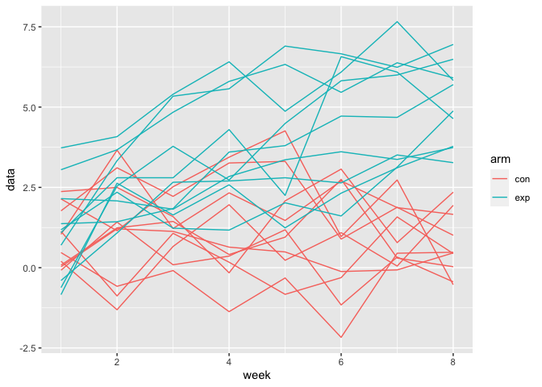

DataScience\_hm5
================
KaiYu He(kh3074)
11/16/2021

``` r
library(tidyverse)
```

    ## ── Attaching packages ─────────────────────────────────────── tidyverse 1.3.1 ──

    ## ✓ ggplot2 3.3.5     ✓ purrr   0.3.4
    ## ✓ tibble  3.1.2     ✓ dplyr   1.0.7
    ## ✓ tidyr   1.1.3     ✓ stringr 1.4.0
    ## ✓ readr   2.0.1     ✓ forcats 0.5.1

    ## ── Conflicts ────────────────────────────────────────── tidyverse_conflicts() ──
    ## x dplyr::filter() masks stats::filter()
    ## x dplyr::lag()    masks stats::lag()

# Problem 1

``` r
homicide_df = 
  read_csv("data/homicide-data.csv",na = c("","Unkonw")) %>%
  mutate(
    city_state = str_c(city,",",state),
    resolution = case_when(
      disposition == "Closed without arrest" ~ "unsolved",
      disposition == "Open/No arrest" ~ "unsolved",
      disposition == "Closed by arrest" ~ "solved"
    )) %>%
  relocate(city_state)%>%
  filter(city_state != "Tusla,AL")
```

    ## Rows: 52179 Columns: 12

    ## ── Column specification ────────────────────────────────────────────────────────
    ## Delimiter: ","
    ## chr (9): uid, victim_last, victim_first, victim_race, victim_age, victim_sex...
    ## dbl (3): reported_date, lat, lon

    ## 
    ## ℹ Use `spec()` to retrieve the full column specification for this data.
    ## ℹ Specify the column types or set `show_col_types = FALSE` to quiet this message.

``` r
homicide_df%>%count(city_state)
```

    ## # A tibble: 51 x 2
    ##    city_state         n
    ##    <chr>          <int>
    ##  1 Albuquerque,NM   378
    ##  2 Atlanta,GA       973
    ##  3 Baltimore,MD    2827
    ##  4 Baton Rouge,LA   424
    ##  5 Birmingham,AL    800
    ##  6 Boston,MA        614
    ##  7 Buffalo,NY       521
    ##  8 Charlotte,NC     687
    ##  9 Chicago,IL      5535
    ## 10 Cincinnati,OH    694
    ## # … with 41 more rows

Let’s focus on Baltimore,MD.

``` r
baltimore_df = 
  homicide_df%>%
  filter(city_state == "Baltimore,MD")

baltimore_summary = 
  baltimore_df%>%
  summarize(
    unsolved = sum(resolution == "unsolved"),
    n = n()
  )

baltimore_test = 
  prop.test(
  x = baltimore_summary%>%pull(unsolved),
  n = baltimore_summary%>%pull(n)
  )

baltimore_test %>%
  broom::tidy()
```

    ## # A tibble: 1 x 8
    ##   estimate statistic  p.value parameter conf.low conf.high method    alternative
    ##      <dbl>     <dbl>    <dbl>     <int>    <dbl>     <dbl> <chr>     <chr>      
    ## 1    0.646      239. 6.46e-54         1    0.628     0.663 1-sample… two.sided

let’s try to iterate across cities! First off, write a function.

``` r
prop_test_function = function(city_df)
  {
  city_summary = 
  city_df%>%
  summarize(
    unsolved = sum(resolution == "unsolved"),
    n = n()
  )

city_test = 
  prop.test(
  x = city_summary%>%pull(unsolved),
  n = city_summary%>%pull(n)
  )
  }
```

Now, let’s iterate across all cities.

``` r
results_df =
  homicide_df%>%
  nest(data = uid:resolution)%>%
  mutate(
    test_result = map(data,prop_test_function),
    tidy_result = map(test_result,broom::tidy)
  )%>%
  select(city_state,tidy_result)%>%
  unnest(tidy_result)%>%
  select(city_state,estimate,starts_with("conf"))
```

    ## Warning in prop.test(x = city_summary %>% pull(unsolved), n = city_summary %>% :
    ## Chi-squared approximation may be incorrect

``` r
results_df
```

    ## # A tibble: 51 x 4
    ##    city_state     estimate conf.low conf.high
    ##    <chr>             <dbl>    <dbl>     <dbl>
    ##  1 Albuquerque,NM    0.386    0.337     0.438
    ##  2 Atlanta,GA        0.383    0.353     0.415
    ##  3 Baltimore,MD      0.646    0.628     0.663
    ##  4 Baton Rouge,LA    0.462    0.414     0.511
    ##  5 Birmingham,AL     0.434    0.399     0.469
    ##  6 Boston,MA         0.505    0.465     0.545
    ##  7 Buffalo,NY        0.612    0.569     0.654
    ##  8 Charlotte,NC      0.300    0.266     0.336
    ##  9 Chicago,IL        0.736    0.724     0.747
    ## 10 Cincinnati,OH     0.445    0.408     0.483
    ## # … with 41 more rows

Try to make a plot showing estimates and confidence intervals.

``` r
results_df%>%
  filter(city_state!="Tulsa,AL")%>%
  mutate(city_state = fct_reorder(city_state,estimate))%>%
  ggplot(aes(x = city_state,y = estimate))+
  geom_point()+
  geom_errorbar(aes(ymin = conf.low,ymax = conf.high))+
  theme(axis.text.x = element_text(angle = 90,vjust = 0.5,hjust = 1))
```

<!-- -->

# Problem 2

### Create a tidy dataframe

Method\_1 using a for loop.

``` r
data_raw = tibble() # Create an empty data frame
Arm = c("exp","con")
Id = str_pad(string = 1:10,width = 2,side = 'left',pad = '0')
for (id in Id){
  for (arm in Arm){
    arm_id = 
      read_csv(str_c("data/Problem_2_data/",arm,"_",id,".csv")) %>%
      mutate(id = id,arm = arm)%>%
      relocate(arm,id)
    data_raw = bind_rows(data_raw,arm_id)
  }
}
```

``` r
data_tidy = 
  data_raw%>%
  janitor::clean_names()%>%
  pivot_longer(week_1:week_8,
              names_to = 'week',
              values_to = 'data')%>%
  mutate(subject = str_c(arm,id))%>%
  select(subject,week,data)%>%
  pivot_wider(names_from = subject,values_from = data)%>%
  mutate(week = as.numeric(str_remove(week,"week_")))
data_tidy
```

    ## # A tibble: 8 x 21
    ##    week exp01 con01 exp02 con02 exp03 con03 exp04 con04 exp05 con05 exp06 con06
    ##   <dbl> <dbl> <dbl> <dbl> <dbl> <dbl> <dbl> <dbl> <dbl> <dbl> <dbl> <dbl> <dbl>
    ## 1     1  3.05  0.2  -0.84  1.13  2.15  1.77 -0.62  1.04  0.7   0.47  3.73  2.37
    ## 2     2  3.67 -1.31  2.63 -0.88  2.08  3.11  2.54  3.66  3.33 -0.58  4.08  2.5 
    ## 3     3  4.84  0.66  1.64  1.07  1.82  2.22  3.78  1.22  5.34 -0.09  5.4   1.59
    ## 4     4  5.8   1.96  2.58  0.17  2.84  3.26  2.73  2.33  5.57 -1.37  6.41 -0.16
    ## 5     5  6.33  0.23  1.24 -0.83  3.36  3.31  4.49  1.47  6.9  -0.32  4.87  2.08
    ## 6     6  5.46  1.09  2.32 -0.31  3.61  0.89  5.82  2.7   6.66 -2.17  6.09  3.07
    ## 7     7  6.38  0.05  3.11  1.58  3.37  1.88  6     1.87  6.24  0.45  7.66  0.78
    ## 8     8  5.91  1.94  3.78  0.44  3.74  1.01  6.49  1.66  6.95  0.48  5.83  2.35
    ## # … with 8 more variables: exp07 <dbl>, con07 <dbl>, exp08 <dbl>, con08 <dbl>,
    ## #   exp09 <dbl>, con09 <dbl>, exp10 <dbl>, con10 <dbl>

Method\_2 using purrr package

``` r
data_raw = 
  tibble(
  file_names = list.files(path = "data/Problem_2_data/")
)%>%
  mutate(file_names = str_c("data/Problem_2_data/",file_names))%>%
  mutate(data = map(file_names,read_csv))%>%
  unnest(data)%>%
  mutate(
    file_names = str_remove(file_names,"data/Problem_2_data/"),
    file_names = str_remove(file_names,".csv")
    )%>%
  separate(file_names,into = c("arm","id"),sep = '_')
```

``` r
data_tidy = 
  data_raw%>%
  janitor::clean_names()%>%
  pivot_longer(week_1:week_8,
              names_to = 'week',
              values_to = 'data')%>%
  mutate(subject = str_c(arm,id))%>%
  select(subject,week,data)%>%
  pivot_wider(names_from = subject,values_from = data)%>%
  mutate(week = as.numeric(str_remove(week,"week_")))
data_tidy
```

    ## # A tibble: 8 x 21
    ##    week con01 con02 con03 con04 con05 con06 con07 con08 con09 con10 exp01 exp02
    ##   <dbl> <dbl> <dbl> <dbl> <dbl> <dbl> <dbl> <dbl> <dbl> <dbl> <dbl> <dbl> <dbl>
    ## 1     1  0.2   1.13  1.77  1.04  0.47  2.37  0.03 -0.08  0.08  2.14  3.05 -0.84
    ## 2     2 -1.31 -0.88  3.11  3.66 -0.58  2.5   1.21  1.42  1.24  1.15  3.67  2.63
    ## 3     3  0.66  1.07  2.22  1.22 -0.09  1.59  1.13  0.09  1.44  2.52  4.84  1.64
    ## 4     4  1.96  0.17  3.26  2.33 -1.37 -0.16  0.64  0.36  0.41  3.44  5.8   2.58
    ## 5     5  0.23 -0.83  3.31  1.47 -0.32  2.08  0.49  1.18  0.95  4.26  6.33  1.24
    ## 6     6  1.09 -0.31  0.89  2.7  -2.17  3.07 -0.12 -1.16  2.75  0.97  5.46  2.32
    ## 7     7  0.05  1.58  1.88  1.87  0.45  0.78 -0.07  0.33  0.3   2.73  6.38  3.11
    ## 8     8  1.94  0.44  1.01  1.66  0.48  2.35  0.46 -0.44  0.03 -0.53  5.91  3.78
    ## # … with 8 more variables: exp03 <dbl>, exp04 <dbl>, exp05 <dbl>, exp06 <dbl>,
    ## #   exp07 <dbl>, exp08 <dbl>, exp09 <dbl>, exp10 <dbl>

### Spaghetti plot

``` r
data_tidy%>%
  pivot_longer(con01:exp10,
               names_to = 'subject',
               values_to = 'data')%>%
  ggplot(aes(x = week,y = data,color = subject))+
  geom_line()
```

<!-- --> To
see the difference between control group and experiement we nee to draw
a plot seperated by group.

``` r
data_tidy%>%
  pivot_longer(con01:exp10,
               names_to = 'subject',
               values_to = 'data')%>%
  mutate(arm = substr(subject,1,3))%>%
  ggplot(aes(x = week,y = data,group = subject))+
  geom_line(aes(color = arm))
```

<!-- -->

-   From the grouped line plot we can conclude that the value of
    experiment group is greater than contorl group.

# Problem 3

### Introduce data

``` r
set.seed(10)
iris_with_missing = iris %>% 
  map_df(~replace(.x, sample(1:150, 20), NA)) %>%
  mutate(Species = as.character(Species))

iris_with_missing = 
  iris_with_missing%>%
  janitor::clean_names()
iris_with_missing
```

    ## # A tibble: 150 x 5
    ##    sepal_length sepal_width petal_length petal_width species
    ##           <dbl>       <dbl>        <dbl>       <dbl> <chr>  
    ##  1          5.1         3.5          1.4         0.2 setosa 
    ##  2          4.9         3            1.4         0.2 setosa 
    ##  3          4.7         3.2          1.3         0.2 setosa 
    ##  4          4.6         3.1          1.5        NA   setosa 
    ##  5          5           3.6          1.4         0.2 setosa 
    ##  6          5.4         3.9          1.7         0.4 setosa 
    ##  7         NA           3.4          1.4         0.3 setosa 
    ##  8          5           3.4          1.5         0.2 setosa 
    ##  9          4.4         2.9          1.4         0.2 setosa 
    ## 10          4.9         3.1         NA           0.1 setosa 
    ## # … with 140 more rows

``` r
fill_missing = function(vector){
  if(typeof(vector[1])=="double"){
  mean = round(mean(vector,na.rm = TRUE),2)
  vector[is.na(vector)] = mean
  round(vector,2)
  vector
  }
  else {
    vector[is.na(vector)] = "virginica"
    vector
  }
}
iris_with_missing %>%
  map(fill_missing)
```

    ## $sepal_length
    ##   [1] 5.10 4.90 4.70 4.60 5.00 5.40 5.82 5.00 4.40 4.90 5.40 4.80 5.82 4.30 5.82
    ##  [16] 5.70 5.40 5.10 5.70 5.10 5.40 5.10 4.60 5.82 4.80 5.00 5.00 5.20 5.82 4.70
    ##  [31] 4.80 5.40 5.20 5.50 4.90 5.00 5.50 4.90 4.40 5.10 5.00 4.50 4.40 5.00 5.10
    ##  [46] 4.80 5.10 4.60 5.30 5.00 7.00 6.40 6.90 5.50 6.50 5.70 6.30 4.90 6.60 5.20
    ##  [61] 5.00 5.90 6.00 6.10 5.60 6.70 5.60 5.80 6.20 5.60 5.90 5.82 6.30 5.82 6.40
    ##  [76] 6.60 6.80 6.70 6.00 5.70 5.50 5.82 5.80 6.00 5.40 5.82 6.70 5.82 5.60 5.50
    ##  [91] 5.50 5.82 5.80 5.00 5.82 5.70 5.70 6.20 5.10 5.70 6.30 5.80 7.10 6.30 6.50
    ## [106] 7.60 4.90 7.30 6.70 5.82 6.50 5.82 6.80 5.70 5.80 6.40 6.50 7.70 7.70 6.00
    ## [121] 5.82 5.60 7.70 6.30 6.70 7.20 6.20 6.10 6.40 7.20 7.40 7.90 6.40 5.82 6.10
    ## [136] 5.82 5.82 6.40 6.00 6.90 6.70 6.90 5.82 6.80 6.70 6.70 6.30 6.50 5.82 5.90
    ## 
    ## $sepal_width
    ##   [1] 3.50 3.00 3.20 3.10 3.60 3.90 3.40 3.40 2.90 3.10 3.08 3.40 3.08 3.00 4.00
    ##  [16] 4.40 3.90 3.50 3.80 3.80 3.40 3.70 3.60 3.30 3.40 3.00 3.40 3.50 3.40 3.20
    ##  [31] 3.10 3.08 3.08 4.20 3.10 3.20 3.50 3.60 3.00 3.40 3.50 3.08 3.20 3.50 3.80
    ##  [46] 3.00 3.80 3.20 3.70 3.08 3.08 3.20 3.10 2.30 2.80 2.80 3.30 2.40 2.90 2.70
    ##  [61] 2.00 3.00 2.20 2.90 2.90 3.10 3.00 3.08 2.20 2.50 3.20 2.80 2.50 2.80 2.90
    ##  [76] 3.00 2.80 3.08 3.08 2.60 2.40 2.40 2.70 2.70 3.00 3.40 3.10 3.08 3.00 2.50
    ##  [91] 3.08 3.08 3.08 2.30 2.70 3.00 2.90 2.90 2.50 2.80 3.08 2.70 3.00 2.90 3.08
    ## [106] 3.00 2.50 2.90 3.08 3.60 3.20 2.70 3.00 3.08 2.80 3.20 3.00 3.80 2.60 2.20
    ## [121] 3.20 3.08 2.80 2.70 3.30 3.20 2.80 3.00 2.80 3.00 2.80 3.80 2.80 2.80 3.08
    ## [136] 3.00 3.40 3.10 3.00 3.10 3.10 3.10 2.70 3.20 3.30 3.00 2.50 3.00 3.40 3.00
    ## 
    ## $petal_length
    ##   [1] 1.40 1.40 1.30 1.50 1.40 1.70 1.40 1.50 1.40 3.77 1.50 1.60 1.40 3.77 3.77
    ##  [16] 1.50 1.30 1.40 1.70 1.50 1.70 1.50 1.00 3.77 1.90 3.77 1.60 1.50 1.40 1.60
    ##  [31] 3.77 1.50 1.50 1.40 3.77 1.20 1.30 1.40 1.30 1.50 1.30 1.30 1.30 1.60 1.90
    ##  [46] 1.40 1.60 3.77 1.50 1.40 4.70 4.50 4.90 4.00 4.60 4.50 4.70 3.77 4.60 3.90
    ##  [61] 3.77 4.20 4.00 4.70 3.60 4.40 4.50 4.10 4.50 3.90 4.80 4.00 4.90 3.77 4.30
    ##  [76] 4.40 4.80 5.00 4.50 3.50 3.80 3.70 3.90 5.10 4.50 4.50 4.70 4.40 3.77 4.00
    ##  [91] 4.40 4.60 4.00 3.30 4.20 4.20 4.20 4.30 3.00 4.10 3.77 5.10 5.90 5.60 5.80
    ## [106] 6.60 4.50 6.30 3.77 3.77 5.10 5.30 5.50 5.00 5.10 5.30 3.77 6.70 6.90 5.00
    ## [121] 5.70 4.90 6.70 4.90 5.70 6.00 4.80 4.90 5.60 5.80 6.10 3.77 3.77 5.10 5.60
    ## [136] 6.10 5.60 5.50 4.80 5.40 5.60 5.10 5.10 3.77 3.77 5.20 5.00 5.20 5.40 5.10
    ## 
    ## $petal_width
    ##   [1] 0.20 0.20 0.20 1.19 0.20 0.40 0.30 0.20 0.20 0.10 0.20 0.20 0.10 0.10 0.20
    ##  [16] 0.40 0.40 1.19 0.30 1.19 0.20 0.40 0.20 0.50 0.20 0.20 0.40 0.20 0.20 0.20
    ##  [31] 0.20 0.40 0.10 0.20 0.20 0.20 0.20 0.10 1.19 0.20 0.30 1.19 0.20 0.60 0.40
    ##  [46] 0.30 0.20 0.20 0.20 0.20 1.40 1.50 1.50 1.30 1.50 1.30 1.60 1.00 1.30 1.40
    ##  [61] 1.00 1.50 1.19 1.40 1.30 1.40 1.50 1.00 1.50 1.10 1.80 1.30 1.50 1.20 1.30
    ##  [76] 1.40 1.40 1.19 1.19 1.00 1.10 1.00 1.20 1.60 1.50 1.60 1.19 1.30 1.19 1.19
    ##  [91] 1.20 1.19 1.19 1.19 1.30 1.20 1.30 1.30 1.19 1.30 2.50 1.90 2.10 1.80 2.20
    ## [106] 2.10 1.70 1.80 1.80 2.50 2.00 1.90 2.10 2.00 2.40 2.30 1.80 1.19 2.30 1.50
    ## [121] 1.19 2.00 2.00 1.80 2.10 1.80 1.80 1.80 2.10 1.60 1.19 2.00 2.20 1.50 1.40
    ## [136] 2.30 1.19 1.19 1.80 2.10 2.40 2.30 1.90 2.30 2.50 2.30 1.90 2.00 2.30 1.80
    ## 
    ## $species
    ##   [1] "setosa"     "setosa"     "setosa"     "setosa"     "setosa"    
    ##   [6] "setosa"     "setosa"     "setosa"     "setosa"     "setosa"    
    ##  [11] "setosa"     "setosa"     "setosa"     "setosa"     "setosa"    
    ##  [16] "setosa"     "setosa"     "setosa"     "setosa"     "setosa"    
    ##  [21] "setosa"     "virginica"  "setosa"     "setosa"     "virginica" 
    ##  [26] "setosa"     "virginica"  "setosa"     "setosa"     "setosa"    
    ##  [31] "setosa"     "setosa"     "setosa"     "setosa"     "setosa"    
    ##  [36] "setosa"     "setosa"     "setosa"     "setosa"     "setosa"    
    ##  [41] "setosa"     "virginica"  "setosa"     "setosa"     "setosa"    
    ##  [46] "virginica"  "setosa"     "setosa"     "setosa"     "setosa"    
    ##  [51] "virginica"  "versicolor" "versicolor" "versicolor" "versicolor"
    ##  [56] "versicolor" "virginica"  "versicolor" "virginica"  "versicolor"
    ##  [61] "versicolor" "versicolor" "versicolor" "versicolor" "versicolor"
    ##  [66] "versicolor" "versicolor" "versicolor" "versicolor" "versicolor"
    ##  [71] "versicolor" "virginica"  "versicolor" "versicolor" "versicolor"
    ##  [76] "versicolor" "versicolor" "versicolor" "versicolor" "virginica" 
    ##  [81] "versicolor" "versicolor" "versicolor" "versicolor" "versicolor"
    ##  [86] "versicolor" "versicolor" "versicolor" "versicolor" "versicolor"
    ##  [91] "versicolor" "versicolor" "versicolor" "virginica"  "versicolor"
    ##  [96] "versicolor" "versicolor" "versicolor" "versicolor" "virginica" 
    ## [101] "virginica"  "virginica"  "virginica"  "virginica"  "virginica" 
    ## [106] "virginica"  "virginica"  "virginica"  "virginica"  "virginica" 
    ## [111] "virginica"  "virginica"  "virginica"  "virginica"  "virginica" 
    ## [116] "virginica"  "virginica"  "virginica"  "virginica"  "virginica" 
    ## [121] "virginica"  "virginica"  "virginica"  "virginica"  "virginica" 
    ## [126] "virginica"  "virginica"  "virginica"  "virginica"  "virginica" 
    ## [131] "virginica"  "virginica"  "virginica"  "virginica"  "virginica" 
    ## [136] "virginica"  "virginica"  "virginica"  "virginica"  "virginica" 
    ## [141] "virginica"  "virginica"  "virginica"  "virginica"  "virginica" 
    ## [146] "virginica"  "virginica"  "virginica"  "virginica"  "virginica"
